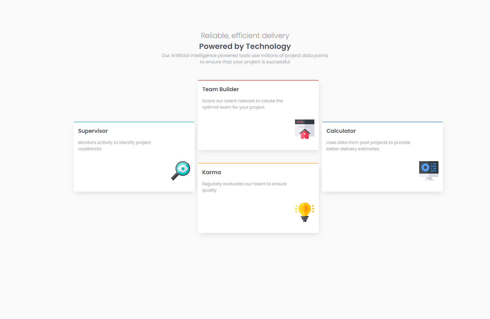
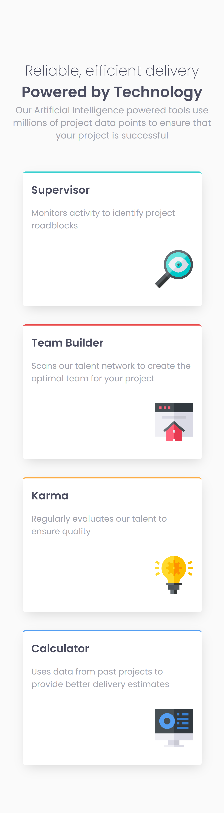

# Frontend Mentor - Four card feature section solution

This is a solution to the [Four card feature section challenge on Frontend Mentor](https://www.frontendmentor.io/challenges/four-card-feature-section-weK1eFYK).

## Table of contents

- [Overview](#overview)
  - [The challenge](#the-challenge)
  - [Screenshot](#screenshot)
- [My process](#my-process)
  - [Built with](#built-with)
  - [What I learned](#what-i-learned)
- [Author](#author)
- [Acknowledgments](#acknowledgments)

## Overview

### The challenge

Users should be able to:

- View the optimal layout for the site depending on their device's screen size

### Screenshot

<details>
  <summary>💻 Desktop</summary>
  
</details>

<details>
  <summary>📱 Mobile</summary>
  
</details>

## My process

### Built with

- Semantic HTML5 markup
- CSS custom properties
- Flexbox
- CSS Grid
- Mobile-first workflow

### What I learned

I learned to use a mobile-first workflow and it was also useful as a practice for flexbox and grid.

Some code snippets:

```html
<div class="cards">
  <div class="cards__card cards__card--cyan">
    <h3>Supervisor</h3>
    <p>Monitors activity to identify project roadblocks</p>
    <figure>
      
    </figure>
  </div>
</div>
```

```css
.cards {
  display: grid;
  grid-template-columns: 1fr 1fr 1fr;
  grid-template-rows: 1fr 1fr 1fr 1fr;
  gap: 2em 1em;
  grid-template-areas:
    '. team-builder .'
    'supervisor team-builder calculator'
    'supervisor karma calculator'
    '. karma .';
  width: 70%;
}
```

## Author

Made with love by [themattfire](github.com/themattfire)

## Acknowledgments

To my beautiful fiancée for helping me on my dev journey @alexcamachogz ❤
